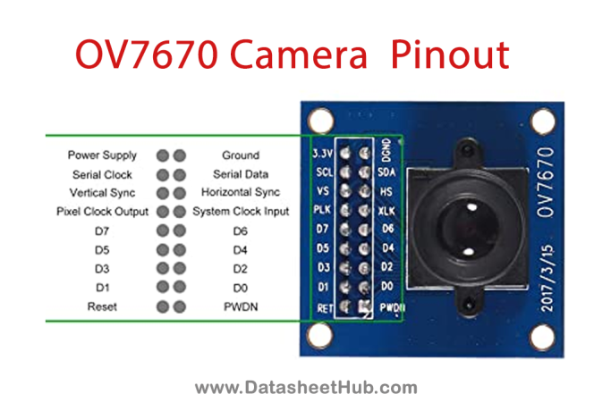

# STM32H747 OV7670 KAMERA PROJESİ
Bu projede Stm32H747 disco board ile ov7670 kamerası bağlanmış ve butona her basıldığında görüntü sd karta ".bmp" formatında kaydedilmesi sağlanmıştır.

## Proje Donanımı
Stm32H747 geliştirme kartında DCMI pinleri 30 pinli FPC soket üzerinden dışarı verilmekte. OV7670 kamerada ise 2.54mm pinler bulunmakta. Bu kartları birbirine bağlayabilmek için dönüştürücü karta ihtiyaç duyulumaktadır.

[Dönuştürücü kart linki.]([image-1.png](https://www.motorobit.com/fpc-40p-05mm-donusturucu-pcb-karti?srsltid=AfmBOopwFkNZVUbiGJ5eD5Rw0iNmTkNrc1ZnX4XCs08Wb9q5swWP8KLOOoI))

## Proje Yazılımı

Yazılım ayarlarında öncelikle kameranın aktif edilmesi için DCMI ayarları yapılmış ardından SDMMC ayarları yapılmıştır. DCMI ayarları için aşağıda verilen linkte sayfa 58 de başlayan adımlar izlenmiştir.

[DCMI için kullanılan kaynak. ](https://www.st.com/resource/en/application_note/an5020-introduction-to-digital-camera-interface-dcmi-for-stm32-mcus-stmicroelectronics.pdf)

> [!WARNING] 
> STM32h747 kartında bazı DCMI pinleriyle SDMMC 4 bits wide bus modu kesiştiği için 1 bit modunda kullanmak durumundayız. SDMMC ayarlını yapabilmek için Linkteli adımları takip edebilirsiniz.

[SDMMC için kullanılan kaynak. ](https://www.st.com/resource/en/application_note/an5020-introduction-to-digital-camera-interface-dcmi-for-stm32-mcus-stmicroelectronics.pdf)

STM32H747 serisi mikrodenetleyicilerde M7 ve M4 olmak üzere 2 adet çekirdek bulunmakta. Debuging için bu bazı ayarların yapılması gerekmekte. Linkleri adımları izleyerek debuging işlemi gerçekleştirilebilir.

[Debuging için kullanılan kaynak. ](https://www.st.com/resource/en/application_note/an5020-introduction-to-digital-camera-interface-dcmi-for-stm32-mcus-stmicroelectronics.pdf)

## ÇIKABİLECEK OLASI PROBLEMLER
- Su sayacında rakamlar değişirlen ara noktada rakamın algılanamaması.
- 

